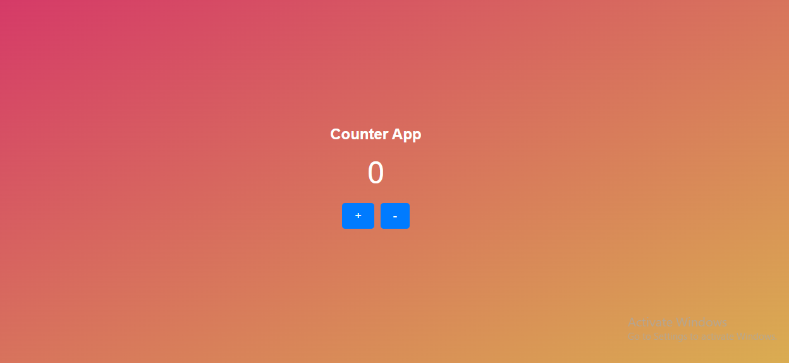

# Counter App

The Counter App is a simple React application that allows you to increment and decrement a counter value. It provides a visually pleasing interface and changes the background color at intervals of 10 (10, 20, 30, etc.) and in reverse (9, 19, 29, etc.).

## Output

## Live Demo Link
(https://counter-a-p-p.netlify.app/)

## Features

- Increment and decrement the counter value.
- Background color changes at intervals of 10 and in reverse.
- Beautifully styled interface.

